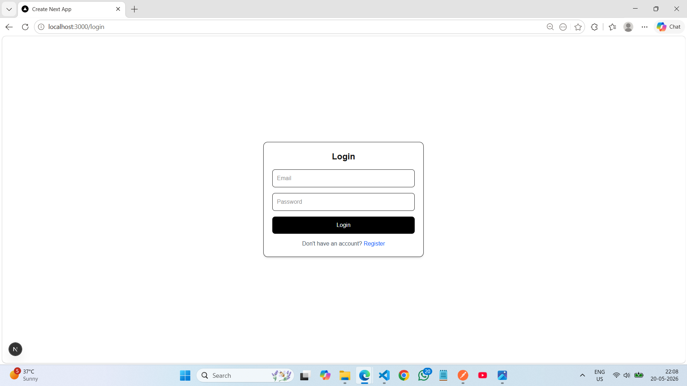
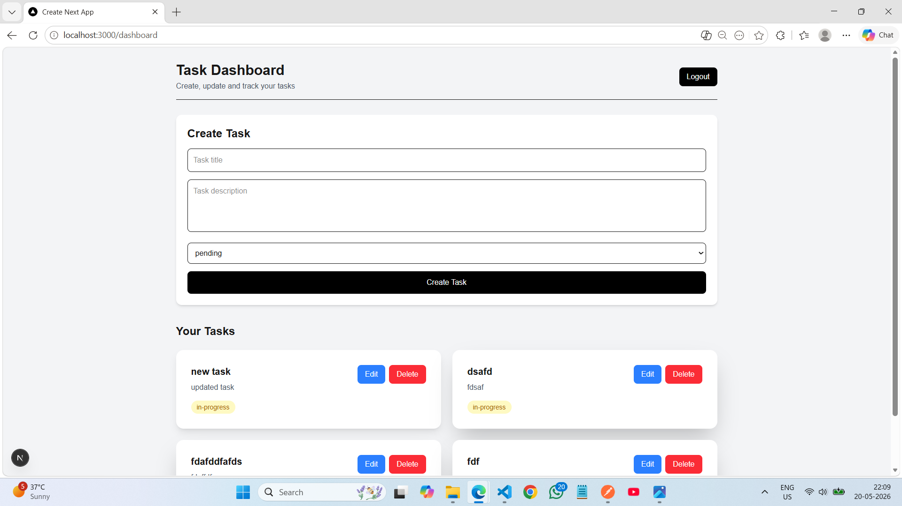
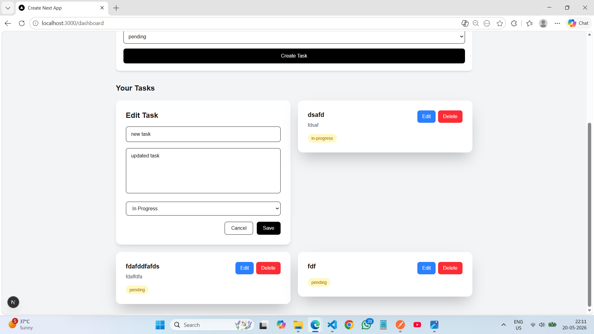

# Backend Internship Assignment - Task Management App

A full-stack task management application built as part of a **Backend Developer Internship Assignment**.

The application demonstrates secure authentication, role-based authorization, protected APIs, and task management functionality with complete frontend integration.

## Key Concepts Implemented

- JWT Authentication
- Role-Based Access Control (RBAC)
- RESTful API Design
- Protected Routes
- Ownership-Based Authorization
- Input Validation & Error Handling
- Frontend Integration using Next.js

---

# Features

# Screenshots

## Login Page



## Dashboard

Protected dashboard with task creation and task listing.



## Edit Task

Inline task editing with update functionality.



---

## Authentication & Authorization

- User Registration
- User Login
- Password Hashing using bcrypt
- JWT Authentication
- Protected Routes
- Persistent Login
- Invalid Token Handling
- Role-Based Access Control (User vs Admin)

### RBAC

The project includes an admin-protected route:

```http
GET /api/v1/auth/admin
```

Only users with the `admin` role can access this route.

Regular users receive an authorization error.

---

## Task Management

### Regular Users Can

- Create Tasks
- View Their Own Tasks
- Update Their Own Tasks
- Delete Their Own Tasks

### Admin Users Can

- Access all tasks
- Access admin-only routes
- Test RBAC functionality

---

## Frontend Features

- Register Page
- Login Page
- Protected Dashboard
- Create Task UI
- Inline Task Editing
- Delete Task
- Authentication Route Guards
- Responsive UI
- Error Feedback Handling

---

# Tech Stack

## Frontend

- Next.js
- React.js
- Tailwind CSS

## Backend

- Node.js
- Express.js
- MongoDB Atlas
- JWT Authentication
- bcryptjs
- Mongoose

---

# Project Structure

```text
assignment/
│
├── frontend/
│   ├── src/
│   ├── .env.local
│   └── package.json
│
├── src/
│   ├── controllers/
│   ├── middleware/
│   ├── models/
│   ├── routes/
│   ├── utils/
│   └── app.js
│
├── postman/
│   ├── Backend-Internship-API.postman_collection.json
│   └── Local-Development.postman_environment.json
│
├── .env
├── package.json
└── README.md
```

---

# Local Setup

## 1. Clone Repository

```bash
git clone https://github.com/mpgit03/task-manager-rbac-api.git
cd task-manager-rbac-api
```

---

## 2. Install Dependencies

### Backend

From the root directory:

```bash
npm install
```

### Frontend

```bash
cd frontend
npm install
```

---

## 3. Configure Environment Variables

### Backend (`.env`)

Create a `.env` file in the root directory:

```env
PORT=5000
MONGO_URI=your_mongodb_connection_string
JWT_SECRET=your_secret_key
```

### Frontend (`frontend/.env.local`)

Create a `.env.local` file inside the `frontend` folder:

```env
NEXT_PUBLIC_API_URL=http://localhost:5000/api/v1
```

---

## 4. Start Backend Server

From the root directory:

```bash
npm run dev
```

Backend runs on:

```text
http://localhost:5000
```

---

## 5. Start Frontend

Open a new terminal:

```bash
cd frontend
npm run dev
```

Frontend runs on:

```text
http://localhost:3000
```

---

# API Endpoints

## Auth Routes

### Register User

```http
POST /api/v1/auth/register
```

### Login User

```http
POST /api/v1/auth/login
```

### Get Current User

```http
GET /api/v1/auth/me
```

### Admin Protected Route

```http
GET /api/v1/auth/admin
```

---

## Task Routes

### Create Task

```http
POST /api/v1/tasks
```

### Get All Tasks

```http
GET /api/v1/tasks
```

### Update Task

```http
PUT /api/v1/tasks/:taskId
```

### Delete Task

```http
DELETE /api/v1/tasks/:taskId
```

---

# Authentication

Protected routes require JWT authentication.

Example:

```http
Authorization: Bearer <token>
```

---

# API Documentation

A ready-to-use Postman collection is included in:

```text
postman/
```

### Included

- Authentication APIs
- Protected Routes
- RBAC Testing
- Task CRUD APIs
- Validation/Error Testing

### JWT Authentication Flow

1. Run the Login API
2. JWT token is automatically stored
3. Protected routes work automatically using Bearer authentication

---

# Test Credentials

## Admin User

```text
Email: admin@test.com
Password: 123456
```

Access:

- Admin Route
- Protected APIs
- Task CRUD
- All Tasks Access

---

## Regular User

```text
Email: user@test.com
Password: 123456
```

Access:

- Task CRUD
- Protected APIs

Cannot access:

```http
GET /api/v1/auth/admin
```

> If credentials do not work, create a user using the Register API.  
> For admin testing, update the user role in MongoDB:

```js
role: "admin"
```

---

# Security Features

- Password Hashing using bcrypt
- JWT Authentication
- Protected Routes
- Invalid Token Handling
- Role-Based Access Control
- Ownership-Based Authorization
- Input Validation
- Error Handling Middleware

---

# Architecture Decisions

### Why JWT Authentication?

JWT was chosen for stateless authentication and secure API access.

### Why RBAC?

Role-Based Access Control was implemented to separate admin and regular user permissions.

### Why Local Storage?

JWT is stored in local storage for simplicity in this assignment.

In a production environment, **httpOnly cookies** would be preferred for better security against XSS attacks.

### Why Modular Backend Structure?

Controllers, middleware, routes, and models were separated to improve maintainability and scalability.

---

# Scalability Notes

If scaled to production, the following improvements would be implemented:

- Redis caching for optimized database reads
- Docker containerization
- Centralized logging & monitoring
- Background job queues
- API rate limiting
- Pagination for large datasets
- Load balancing
- Microservice architecture

---

# Known Limitations

- JWT is stored in local storage for simplicity
- No refresh token implementation
- No pagination/filtering on tasks yet
- No deployment included

---

# Future Improvements

- Task filtering
- Pagination
- Search functionality
- File uploads
- Email notifications
- Better UI feedback system
- Deployment (Vercel + Render)

---

# Author

Built by **Marut** as part of a Backend Developer Internship Assignment.